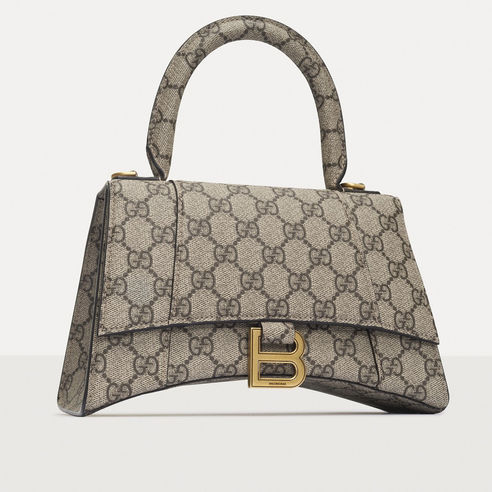

# The Intricacies of Replica Gucci Bags: An Expert's Insight

In the world of fashion, few names resonate as strongly as Gucci. Known for its luxurious designs and impeccable craftsmanship, Gucci has become synonymous with high-end fashion. However, the allure of owning a piece of this luxury comes at a price, leading many to explore the option of replica Gucci bags. This article delves into the complex realm of replica Gucci bags, exploring their appeal, quality, and the ethical considerations involved.

## Understanding Replica Gucci Bags

Replica Gucci bags are designed to mimic the authentic versions in look and feel, often making it difficult to distinguish between the real deal and a well-made replica. The term "replica" implies an intention to replicate the original design as closely as possible without infringing on copyrights or trademarks. When considering a [replica Gucci bag](https://www.luxurydo.ru/ss_replica-gucci-bags.html), one must understand that these items do not bear the official brand's mark and are produced independently.

### The Appeal of Replicas

The primary draw of replica Gucci bags lies in their accessibility. Authentic Gucci products come with a hefty price tag, making them unattainable for many fashion enthusiasts. Replicas offer a more affordable alternative, allowing individuals to enjoy the aesthetic and style associated with Gucci without the significant financial investment. 

### Quality Considerations

While the allure of replicas is undeniable, their quality can vary significantly. High-quality replicas strive to use similar materials and craftsmanship techniques as the originals, resulting in products that are nearly indistinguishable from the authentic items. However, lower quality replicas may fall short in terms of material durability and overall finish. It's crucial for consumers to research thoroughly and purchase from reputable sources to ensure they receive a product that meets their expectations.

## Ethical Considerations

The production and sale of replica Gucci bags raise ethical questions regarding intellectual property rights and the impact on the luxury industry. Brands like Gucci invest heavily in design, marketing, and quality assurance. Purchasing replicas can be seen as undermining these efforts and contributing to a cycle that devalues creativity and innovation. As consumers, it's important to weigh the desire for luxury against the ethical implications of supporting counterfeit goods.

## Making an Informed Decision

When considering purchasing a replica Gucci bag, it's essential to approach the decision with awareness and responsibility. Investigate the source of your purchase, assess the quality of the product, and reflect on the broader implications of your choice. For those who wish to indulge in the Gucci experience without the premium price, options like second-hand or vintage Gucci bags could provide a legitimate alternative.

For further exploration into the world of replica Gucci bags, including detailed reviews and comparisons, visit [this link](https://www.luxurydo.ru/ss_replica-gucci-bags.html). Here, you will find comprehensive insights that can guide you in making an informed decision about whether a replica Gucci bag is right for you.

In conclusion, while replica Gucci bags present an enticing opportunity for fashion lovers to access high-end styles, it's crucial to navigate this space thoughtfully. By understanding the nuances of replicas, assessing their quality, and considering the ethical dimensions, consumers can make choices that align with both their desires and values.
